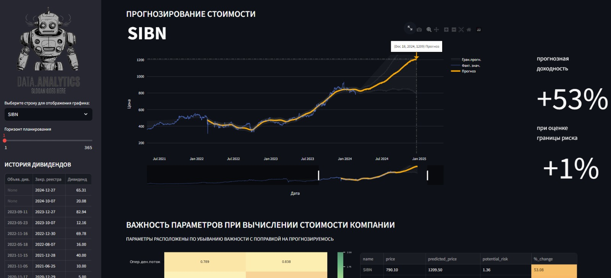
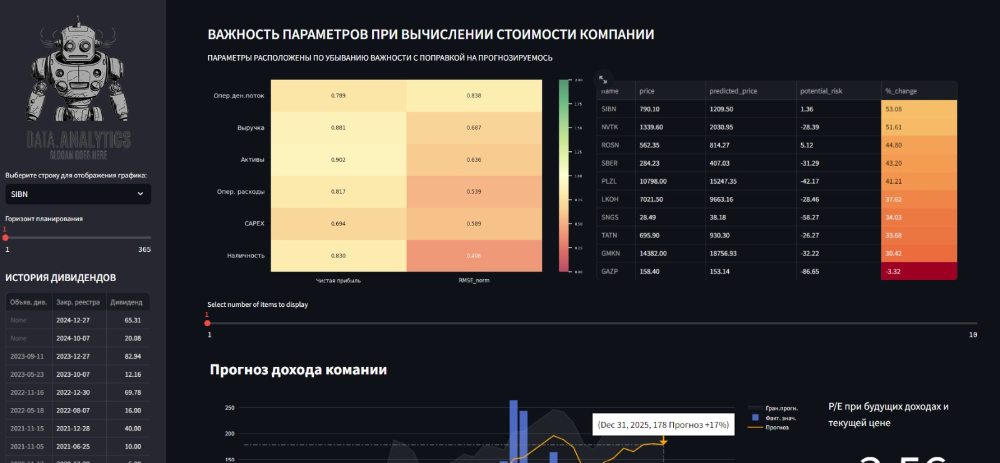
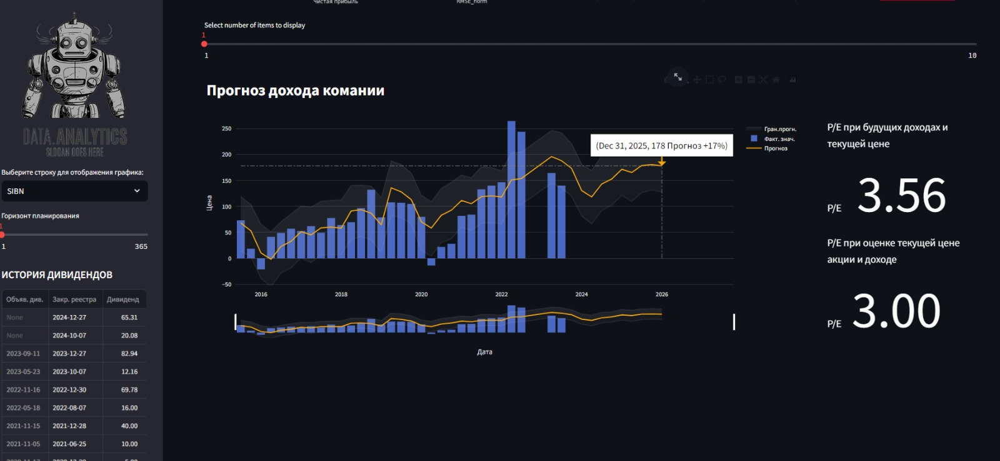

# СЕРВИС ПРОГНОЗИРОВАНИЯ СТОИМОСТИ АКЦИЙ КРУПНЕЙШИХ КОМПАНИЙ ММВБ
## 1. Обработка данных финансовых рынков и анализ фундаментальных показателей:
- Используется веб-скрейпинг для загрузки списка тикеров топ-10 компаний ММВБ, загружаются котировки с использованием [API Московской Биржи (MOEX)](https://www.moex.com/ru/), дивидендные истории компаний и квартальные отчеты компаний с веб-сайта [smart-lab.ru](https://smart-lab.ru/).
   
- Для каждого тикера вычисляются наиболее значимые фундаментальные метрики, их корреляция с капитализацией компании и нормализованный RMSE (среднеквадратичная ошибка). Данные сохраняются в CSV-файлы.

- Производится прогнозирование дохода компаний и стоимости компании на следующие 10 кварталов.

- Данные прогноза объединяются в одну таблицу в формате CSV, предоставляя дополнительную информацию о предсказаниях цен акций.


## 2. **Визуализация данных в Streamlit:**

- [**Интерактивный выбор акции**](#): Пользователь может выбрать конкретную акцию, регулировать положение слайдеров диапазона дат, при наведении курсора всплывает информация доходности в любой точке времени.
  
- [**Доверительный диапазон прогноза**](#): Для выбранной акции представлен график с помеченым диапазоном верхней и нижней границы вариации, что позволяет учитывать возможную неопределенность прогноза.
  
- [**Индивидуально расчитанные корреляции**](#): Для каждой выбранной акции отображаются корреляции между личными наиболее значимыми фундаментальными показателями и стоимостью, дополнительно представлен коэфициент прогнозирования. Для каждой компании представлена история и прогнозируемые выплаты дивидендов.Это позволяет оценить на какие аспекты обращают внимание инвесторы в данной компании и дивидендную политику компании.

  <div style="display: flex;">
    
    
    
</div>

### Структура проекта:

- **src/**: Папка для исходного кода проекта
  - `data_loader.py`: Модуль для загрузки данных о ценах акций, прогнозах и дивидендах.
  - `plot_loader.py`: Модуль для отображения графиков цен акций и прогнозов.
  - `income_loader.py`: Модуль для отображения данных о доходах и дополнительных метрик.
  - `utils.py`: Модуль с вспомогательными функциями для обработки данных и визуализации.
  - `main.py`: Основной скрипт для работы с визуальной частью сервса с использованием Streamlit.


- **data/**: Папка для хранения загруженных данных
  - `<ticker>_h_<start>-<stop>.csv`: CSV файлы с данными котировок для каждого тикера
  - `<ticker>_dividend_table.csv`: CSV файлы с дивидендной историей для каждого тикера
  - `<ticker>_income.csv`: CSV файлы с квартальными отчетами для каждого тикера

- **export/streamlit/**: Папка для экспорта результатов анализа для файлов, используемых в приложении Streamlit
    - `<ticker>_forecast.csv`: Прогнозные данные для каждого тикера
    - `<ticker>_dividend_table.csv`: Данные дивидендов для каждого тикера
    - `<ticker>_income.csv`: Квартальные отчеты для каждого тикера
    - `<ticker>_forcast_dividend.csv`: Прогнозы дивидендов для каждого тикера
    - `<ticker>_correlation_table.csv`: Корреляция фундаментальных метрик для каждого тикера
    - `00_sums_data.csv`: Общий файл с данными для анализа

- **img/**: Папка с изображениями для отображения в боковой панели.

   - `requirements.txt`: Файл со списком зависимостей проекта.
   - `README.md`: Файл с описанием проекта, инструкциями по установке и использованию.


- [Python](https://www.python.org/) для анализа данных и предобработки
- [BeautifulSoup](https://www.crummy.com/software/BeautifulSoup/bs4/doc/) для веб-скрейпинга
- [Pandas](https://pandas.pydata.org/) для обработки и анализа данных
- [Matplotlib](https://matplotlib.org/) и [Seaborn](https://seaborn.pydata.org/) для визуализации данных
- [Prophet](https://facebook.github.io/prophet/) для прогнозирования временных рядов
- [Streamlit](https://streamlit.io/) для создания веб-приложения (если используется)

### Установка и запуск:
1. Склонируйте репозиторий:

```bash
git clone git@github.com:AlexanderGithubProfile/STOCK_PREDICTION.git
```

2. Установите необходимые зависимости, выполнив команду:
```bash
pip install -r requirements.txt
```
3. Установите Streamlit:

```bash
pip install streamlit
```
4. Запустите скрипт или приложение для обработки данных и анализа финансовых рынков:
```bash
streamlit run src/main.py
```
После запуска приложения откроется веб-интерфейс, где вы сможете выбрать акцию из доступного списка и ознакомиться с прогнозом стоимости, а также другими параметрами.

