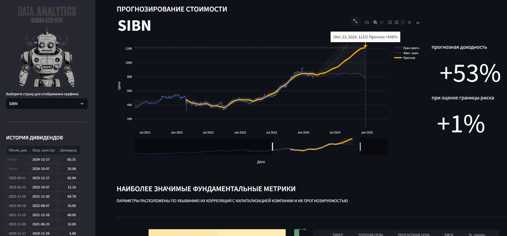
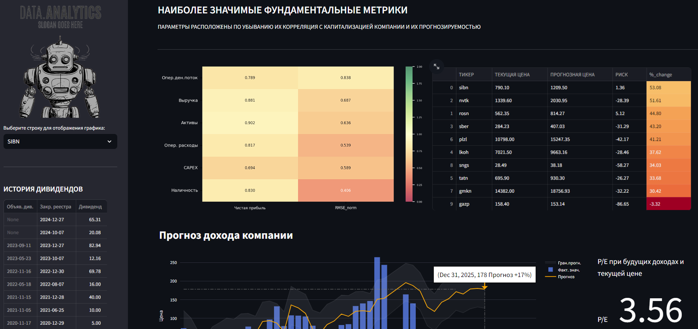
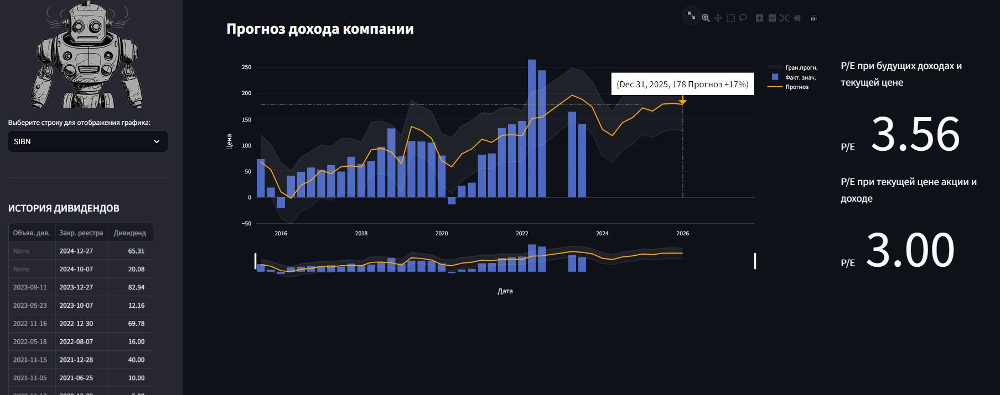

# СЕРВИС ПРОГНОЗИРОВАНИЯ СТОИМОСТИ АКЦИЙ КРУПНЕЙШИХ КОМПАНИЙ ММВБ
### Обработка данных финансовых рынков и анализ фундаментальных показателей:
- Используется веб-скрейпинг для загрузки списка тикеров топ-10 компаний ММВБ, загружаются котировки с использованием [API Московской Биржи (MOEX)](https://www.moex.com/ru/), дивидендные истории компаний и квартальные отчеты компаний с веб-сайта [smart-lab.ru](https://smart-lab.ru/).
   
- Вычисляются наиболее значимые фундаментальные метрики, их корреляция с капитализацией компании через нормализованный RMSE(среднеквадратичная ошибка) как способность модели их прогнозировать.
  
- Производится прогнозирование дохода компаний и стоимости компании на следующие 10 кварталов и затем для итогового выбора данные резюмируются в одну таблицу.


### **Визуализация данных в Streamlit:**

- [**Интерактивный выбор акции**](#): выпадающие списки акций, слайдеры регулировки диапазона дат, отображение доходности при наведении курсора в любой точке времени.
  
- [**Доверительный диапазон прогноза**](#): график с нижней и верхней границей прогноза  
  
- [**Индивидуально расчитанные корреляции**](#): между наиболее значимыми фундаментальными показателями и стоимостью, дополнительно представлен коэфициент прогнозирования, история и прогнозируемые выплаты дивидендов 

  <div style="display: flex;">
    
    
    
</div>

### Структура проекта:

- **src/**: Исходный код проекта
  - `data_loader.py`: Загрузка данных о ценах акций, прогнозах и дивидендах
  - `plot_loader.py`: Отображение графиков цен и прогнозов
  - `income_loader.py`: Отображение данных о доходах и метриках
  - `utils.py`: Вспомогательные функции для обработки данных и визуализации
  - `main.py`: Основной скрипт для работы с Streamlit

- **data/**: Хранение загруженных данных
  - `<ticker>_h_<start>-<stop>.csv`: Котировки для каждого тикера
  - `<ticker>_dividend_table.csv`: Дивидендная история
  - `<ticker>_income.csv`: Квартальные отчеты

- **export/streamlit/**: Экспорт результатов анализа
  - `<ticker>_forecast.csv`: Прогнозы для каждого тикера.
  - `<ticker>_dividend_table.csv`: Дивиденды для каждого тикера.
  - `<ticker>_income.csv`: Квартальные отчеты.
  - `<ticker>_forcast_dividend.csv`: Прогнозы дивидендов.
  - `<ticker>_correlation_table.csv`: Корреляция метрик.
  - `00_sums_data.csv`: Общие данные для анализа.

- **img/**: Изображения для боковой панели.

- `requirements.txt`: Зависимости проекта.
- `README.md`: Описание проекта и инструкции.

### Используемые библиотеки
> - [python](https://www.python.org/) анализа данных и предобработки
> - [beautifulSoup](https://www.crummy.com/software/BeautifulSoup/bs4/doc/) веб-скрейпинга
> - [pandas](https://pandas.pydata.org/) обработка и анализ данных
> - [matplotlib](https://matplotlib.org/), [Plotly Express]() и [Seaborn](https://seaborn.pydata.org/) визуализация данных
> - [prophet](https://facebook.github.io/prophet/) для прогнозирования временных рядов
> - [streamlit](https://streamlit.io/) для создания веб-приложения (если используется)

## Начало работы:
- **Склонируйте репозиторий и установите необходимые зависимости:**

```bash
# Клонирование репозитория и установка зависимостей
git clone git@github.com:AlexanderGithubProfile/STOCK_PREDICTION.git
pip install -r requirements.txt
```
- **Установите Streamlit и запустите скрипт или приложение для обработки данных и анализа финансовых рынков:**

```bash
# Запуск demo на streamlit
pip install streamlit
streamlit run src/main.py
```

